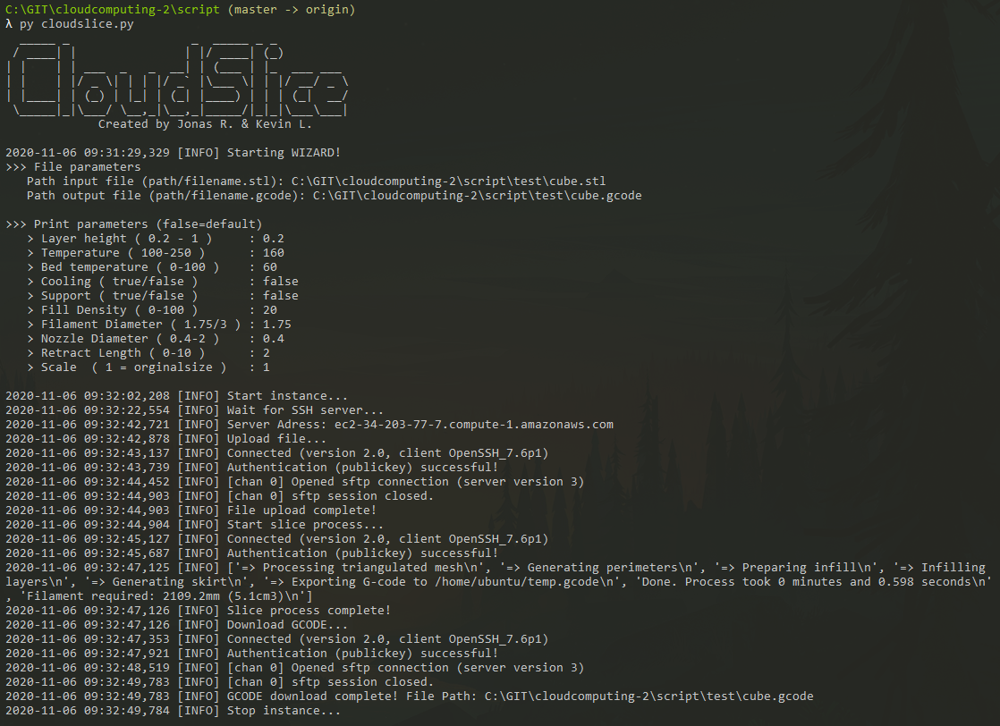

# Cloud Computing 2 - CloudSlice 

## About The Project

This script is used outsource the slicing processes to the AWS cloud. The slicing processes can quickly and source-efficiently calculate the GCODE for 3D printers in AWS EC2 with Slic3r.
### Built With

* [Python 3](https://www.python.org/downloads/)
* [Slic3r](https://slic3r.org/)
* [EC2](https://aws.amazon.com/ec2)

### Documentation

* [Docu](./docu/docu.pdf)